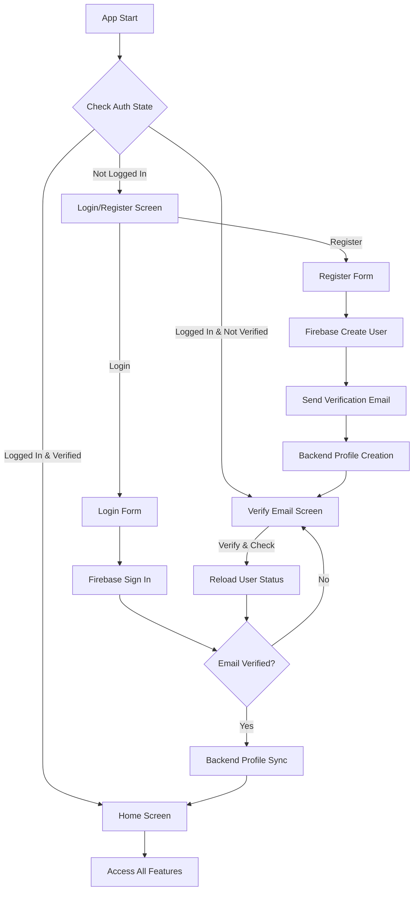

# Module 1 — User Registration, Login & Profile

## Overview

Module 1 implements a complete authentication and user profile management system for the STJ (Spiritual/Joshiyam) application. It establishes the foundation for user identity management, combining Firebase Authentication for secure auth operations with a custom MongoDB backend for extended profile data.

**Key Rule**: User must **Register → Verify Email → Login → Home**. All other app features (Josiyam, Daily, Chat, etc.) are accessible only after successful authentication.

---

## Architecture

### Technology Stack

| Layer | Technology | Purpose |
|-------|-----------|---------|
| **Frontend** | Flutter | Cross-platform mobile UI |
| **State Management** | BLoC (flutter_bloc) | Predictable state management |
| **Authentication** | Firebase Auth | Secure user authentication & email verification |
| **Backend API** | Node.js + Express | RESTful API server |
| **Database** | MongoDB | User profile storage |
| **HTTP Client** | Dio | Network requests |
| **Local Storage** | SharedPreferences | Token persistence |

### Architecture Pattern

The project follows **Clean Architecture** principles with three distinct layers:

```
┌─────────────────────────────────────────────────────┐
│                 PRESENTATION LAYER                   │
│  (UI Pages, Widgets, BLoC - State Management)       │
└─────────────────────────────────────────────────────┘
                        │
                        ↓
┌─────────────────────────────────────────────────────┐
│                   DOMAIN LAYER                       │
│     (Entities, Use Cases, Repository Interfaces)    │
└─────────────────────────────────────────────────────┘
                        │
                        ↓
┌─────────────────────────────────────────────────────┐
│                    DATA LAYER                        │
│  (Models, Data Sources, Repository Implementations) │
└─────────────────────────────────────────────────────┘
```

---

## Features Implemented

### 1. User Registration
- Collect required fields: Name, Email, Password
- Collect optional fields: DOB, Birth Time, Birth Place, Phone
- Email/password validation
- Firebase Auth user creation
- Automatic email verification dispatch
- Backend profile creation in MongoDB

### 2. Email Verification
- Send verification email via Firebase
- Resend verification option
- Check verification status
- Block app access until verified

### 3. User Login
- Email/password authentication
- Firebase token generation
- Backend profile sync
- Redirect to Home on success
- Redirect to verification if email not verified

### 4. Profile Management
- View current profile
- Update profile information
- Edit DOB, birth time, birth place, phone
- Real-time profile sync with backend

### 5. Password Recovery
- Forgot password functionality
- Password reset email dispatch
- Firebase-managed reset flow

### 6. Session Management
- Persistent login state
- Automatic auth state detection
- Secure logout

---

## Project Structure

```
lib/
├── core/
│   ├── constants/
│   │   ├── api_constants.dart      # API URLs, endpoints, timeouts
│   │   └── app_constants.dart      # App-wide constants, routes
│   │
│   ├── network/
│   │   ├── dio_client.dart         # Dio HTTP client configuration
│   │   └── api_service.dart        # Generic API methods (GET, POST, PUT, DELETE)
│   │
│   ├── services/
│   │   ├── firebase_auth_service.dart  # Firebase Auth wrapper
│   │   └── token_service.dart          # Token storage service
│   │
│   └── utils/
│       ├── validators.dart         # Form validation utilities
│       └── date_utils.dart         # Date/time formatting utilities
│
├── features/
│   └── auth/
│       ├── data/
│       │   ├── models/
│       │   │   └── user_model.dart              # UserModel with JSON serialization
│       │   │
│       │   ├── datasources/
│       │   │   ├── auth_firebase_datasource.dart  # Firebase Auth operations
│       │   │   └── auth_remote_datasource.dart    # Backend API operations
│       │   │
│       │   └── repositories/
│       │       └── auth_repository_impl.dart      # Repository implementation
│       │
│       ├── domain/
│       │   ├── entities/
│       │   │   └── user_entity.dart           # Core user entity
│       │   │
│       │   ├── repositories/
│       │   │   └── auth_repository.dart       # Repository interface
│       │   │
│       │   └── usecases/
│       │       ├── register_user.dart         # Register use case
│       │       ├── login_user.dart            # Login use case
│       │       ├── verify_email.dart          # Verify email use case
│       │       ├── resend_verification.dart   # Resend verification use case
│       │       ├── forgot_password.dart       # Forgot password use case
│       │       ├── get_profile.dart           # Get profile use case
│       │       └── update_profile.dart        # Update profile use case
│       │
│       └── presentation/
│           ├── bloc/
│           │   ├── auth_bloc.dart             # BLoC implementation
│           │   ├── auth_event.dart            # Auth events
│           │   └── auth_state.dart            # Auth states
│           │
│           ├── pages/
│           │   ├── splash_page.dart           # Splash/initial screen
│           │   ├── login_page.dart            # Login screen
│           │   ├── register_page.dart         # Registration screen
│           │   ├── verify_email_page.dart     # Email verification screen
│           │   ├── forgot_password_page.dart  # Password reset screen
│           │   └── profile_page.dart          # Profile management screen
│           │
│           └── widgets/
│               ├── auth_textfield.dart        # Reusable text field widget
│               ├── auth_button.dart           # Reusable button widget
│               └── verify_banner.dart         # Email verification banner
│
├── routes/
│   └── app_routes.dart                        # App routing configuration
│
├── app.dart                                   # Main app widget
└── main.dart                                  # App entry point with DI setup
```

---

## Authentication Flow



---

## Database Schema

### MongoDB Collection: `users` (or `profiles`)

```javascript
{
  "_id": ObjectId("..."),
  "firebaseUid": "abc123firebaseUid",        // Unique, indexed
  "email": "user@example.com",               // Required
  "name": "Ramesh Kumar",                    // Required
  "dob": ISODate("1990-05-15T00:00:00Z"),   // Optional
  "birthTime": "08:30",                      // Optional, HH:mm format
  "birthPlace": "Chennai, Tamil Nadu",       // Optional
  "phone": "+919876543210",                  // Optional
  "emailVerified": true,                     // Boolean
  "createdAt": ISODate("2026-03-09T10:00:00Z"),
  "updatedAt": ISODate("2026-03-09T10:00:00Z")
}
```

**Indexes:**
- `firebaseUid`: Unique index for fast lookup
- `email`: Index for searching by email

---

## API Endpoints

### Base URL
```
http://localhost:3000
```

### Endpoints

#### 1. **POST /auth/register**
Register a new user and create profile in MongoDB.

**Headers:**
```
Authorization: Bearer <firebaseIdToken>
Content-Type: application/json
```

**Request Body:**
```json
{
  "name": "Ramesh Kumar",
  "email": "ramesh@example.com",
  "dob": "1990-05-15T00:00:00Z",        // Optional
  "birthTime": "08:30",                  // Optional
  "birthPlace": "Chennai",               // Optional
  "phone": "+919876543210"               // Optional
}
```

**Response (200 OK):**
```json
{
  "firebaseUid": "abc123",
  "email": "ramesh@example.com",
  "name": "Ramesh Kumar",
  "dob": "1990-05-15T00:00:00Z",
  "birthTime": "08:30",
  "birthPlace": "Chennai",
  "phone": "+919876543210",
  "emailVerified": false,
  "createdAt": "2026-03-09T10:00:00Z",
  "updatedAt": "2026-03-09T10:00:00Z"
}
```

---

#### 2. **POST /auth/verify**
Verify Firebase token and sync/create user profile.

**Headers:**
```
Authorization: Bearer <firebaseIdToken>
```

**Response (200 OK):**
```json
{
  "firebaseUid": "abc123",
  "email": "ramesh@example.com",
  "name": "Ramesh Kumar",
  // ... other profile fields
}
```

---

#### 3. **GET /profile**
Get current user's profile.

**Headers:**
```
Authorization: Bearer <firebaseIdToken>
```

**Response (200 OK):**
```json
{
  "firebaseUid": "abc123",
  "email": "ramesh@example.com",
  "name": "Ramesh Kumar",
  // ... other profile fields
}
```

---

#### 4. **PUT /profile**
Update user profile.

**Headers:**
```
Authorization: Bearer <firebaseIdToken>
Content-Type: application/json
```

**Request Body:**
```json
{
  "name": "Ramesh Kumar Updated",       // Optional
  "dob": "1990-05-15T00:00:00Z",       // Optional
  "birthTime": "09:00",                 // Optional
  "birthPlace": "Mumbai",               // Optional
  "phone": "+919876543211"              // Optional
}
```

**Response (200 OK):**
```json
{
  "firebaseUid": "abc123",
  "email": "ramesh@example.com",
  "name": "Ramesh Kumar Updated",
  // ... updated profile fields
}
```

---

## BLoC State Management

### Events

```dart
AuthCheckRequested              // Check initial auth state
AuthRegisterRequested          // Register new user
AuthLoginRequested             // Login user
AuthLogoutRequested            // Logout user
AuthVerifyEmailRequested       // Check email verification status
AuthResendVerificationRequested // Resend verification email
AuthForgotPasswordRequested    // Send password reset email
AuthGetProfileRequested        // Fetch user profile
AuthUpdateProfileRequested     // Update user profile
```

### States

```dart
AuthInitial                    // Initial state
AuthLoading                    // Loading/processing state
AuthAuthenticated              // User logged in and verified
AuthUnauthenticated            // User not logged in
AuthEmailNotVerified           // User logged in but email not verified
AuthError                      // Error state with message
AuthSuccess                    // Success state with message
AuthVerificationEmailSent      // Verification email sent
AuthPasswordResetEmailSent     // Password reset email sent
```

---

## Screen Descriptions

### 1. Splash Page
- Initial loading screen
- Checks authentication state
- Routes to appropriate screen:
  - **Logged in & verified** → Home
  - **Logged in & not verified** → Verify Email
  - **Not logged in** → Login

### 2. Register Page
- **Required fields**: Name, Email, Password, Confirm Password
- **Optional fields**: Phone, DOB (date picker), Birth Time (time picker), Birth Place
- Real-time validation
- Creates Firebase user
- Sends verification email
- Creates MongoDB profile
- Navigates to Verify Email page

### 3. Login Page
- Email and password fields
- "Forgot Password?" link
- "Don't have an account? Register" link
- Firebase authentication
- Backend profile sync
- Routes to Home or Verify Email based on status

### 4. Verify Email Page
- Information message about email verification
- "Check Verification Status" button
- "Resend Verification Email" button
- "Back to Login" option
- Blocks access to Home until verified

### 5. Forgot Password Page
- Email input field
- Sends password reset email via Firebase
- Confirmation message
- Returns to Login page

### 6. Profile Page
- Display user information
- Edit name, phone, DOB, birth time, birth place
- Update button
- Logout option
- Real-time profile updates

### 7. Home Page
- Main landing page after authentication
- Access to all app features (TODO: needs implementation)
- Navigation to other modules (Josiyam, Daily, Chat, etc.)

---

## Setup Instructions

### Prerequisites
- Flutter SDK 3.10+ installed
- Firebase project created
- Node.js and MongoDB for backend (separate setup)

### Frontend Setup

1. **Install Dependencies**
```bash
cd client
flutter pub get
```

2. **Configure Firebase**
   - Download `google-services.json` (Android) from Firebase Console
   - Place in `android/app/`
   - Download `GoogleService-Info.plist` (iOS) from Firebase Console
   - Place in `ios/Runner/`

3. **Update API Base URL**
Edit `lib/core/constants/api_constants.dart`:
```dart
static const String baseUrl = 'http://your-backend-url:3000';
```

4. **Run the App**
```bash
flutter run
```

### Backend Setup (TODO)
Backend implementation needed with:
- Node.js + Express server
- MongoDB connection
- Firebase Admin SDK
- Auth middleware for token verification
- CRUD endpoints for user profile

---

## Configuration Files

### pubspec.yaml Dependencies
```yaml
dependencies:
  flutter_bloc: ^8.1.6      # State management
  equatable: ^2.0.5         # Value equality
  firebase_core: ^3.6.0     # Firebase core
  firebase_auth: ^5.3.1     # Firebase authentication
  dio: ^5.7.0               # HTTP client
  shared_preferences: ^2.3.2 # Local storage
  intl: ^0.19.0             # Internationalization
```

### API Constants
- **Base URL**: `http://localhost:3000`
- **Register Endpoint**: `/auth/register`
- **Verify Endpoint**: `/auth/verify`
- **Profile Endpoint**: `/profile`
- **Connection Timeout**: 30 seconds
- **Receive Timeout**: 30 seconds

---

## Testing

### Running Tests
```bash
# Run all tests
flutter test

# Run tests with coverage
flutter test --coverage
```

### Test Files
- `test/widget_test.dart` - Basic smoke test

---

## Troubleshooting

### Common Issues

**Issue: "Target of URI doesn't exist" errors**
- **Solution**: Run `flutter pub get` to install dependencies

**Issue: Firebase not initialized**
- **Solution**: Ensure `google-services.json` (Android) and `GoogleService-Info.plist` (iOS) are in correct locations

**Issue: API connection failed**
- **Solution**: Verify backend server is running and base URL is correct in `api_constants.dart`

**Issue: Email verification not working**
- **Solution**: Check Firebase Console → Authentication → Email verification settings

---

## Validation Rules

### Email
- Required field
- Must be valid email format
- RegEx: `^[\w-\.]+@([\w-]+\.)+[\w-]{2,4}$`

### Password
- Required field
- Minimum 6 characters (Firebase requirement)

### Name
- Required field
- Minimum 2 characters

### Phone
- Optional field
- E.164 format or national format accepted
- RegEx: `^\+?[1-9]\d{1,14}$`

### DOB, Birth Time, Birth Place
- All optional fields
- Used for Josiyam calculations in future modules

---

## Authentication Rules

1. **Registration**: User must provide name, email, password
2. **Email Verification**: Mandatory before accessing main features
3. **Login**: Only verified users can access Home and other features
4. **Profile**: Can be updated anytime after login
5. **Session**: Persists across app restarts until logout

---

## Future Enhancements

- [ ] Google Sign-In integration
- [ ] Phone OTP authentication
- [ ] Biometric authentication
- [ ] Profile photo upload
- [ ] Account deletion
- [ ] Email change functionality
- [ ] Multi-factor authentication (MFA)
- [ ] Social media login (Facebook, Apple)

---

## Module 1 Checklist

### Frontend (Flutter)
- [x] Splash screen with auth state check
- [x] Register screen with required and optional fields
- [x] Email verification flow (send, resend, verify)
- [x] Login screen with email/password
- [x] Forgot password functionality
- [x] Home screen placeholder
- [x] Profile management screen
- [x] Auth guard for protected routes
- [x] API integration (register, verify, profile CRUD)
- [x] Clean Architecture implementation
- [x] BLoC state management

### Backend (Node Express) - TODO
- [ ] Firebase Admin SDK integration
- [ ] Auth middleware (token verification)
- [ ] POST /auth/register endpoint
- [ ] POST /auth/verify endpoint
- [ ] GET /profile endpoint
- [ ] PUT /profile endpoint
- [ ] Error handling and validation

### Database (MongoDB) - TODO
- [ ] Users/profiles collection
- [ ] Schema with firebaseUid, email, name, etc.
- [ ] Unique index on firebaseUid
- [ ] CRUD operations

---

## API Response Codes

| Code | Status | Description |
|------|--------|-------------|
| 200 | OK | Request successful |
| 201 | Created | Resource created successfully |
| 400 | Bad Request | Invalid request data |
| 401 | Unauthorized | Invalid or missing auth token |
| 404 | Not Found | Resource not found |
| 409 | Conflict | Resource already exists |
| 500 | Internal Server Error | Server error |

---

## Security Considerations

1. **Firebase Auth**: All passwords handled by Firebase (never stored in MongoDB)
2. **Token Verification**: All protected endpoints verify Firebase ID token
3. **Input Validation**: Server-side validation for all user inputs
4. **HTTPS**: Use HTTPS in production for all API calls
5. **Token Expiry**: Firebase tokens automatically expire and refresh
6. **Rate Limiting**: Should be implemented in backend (TODO)

---

## Developer Notes

### Adding New Auth Features
1. Create use case in `domain/usecases/`
2. Update repository interface and implementation
3. Add event in `auth_event.dart`
4. Add state in `auth_state.dart`
5. Handle event in `auth_bloc.dart`
6. Create/update UI in `presentation/pages/`

### Modifying User Schema
1. Update `UserEntity` in `domain/entities/`
2. Update `UserModel` in `data/models/`
3. Update backend MongoDB schema
4. Update API request/response formats

---

## Support

For issues or questions:
- Check troubleshooting section above
- Review Firebase Console logs
- Check Flutter logs: `flutter logs`
- Verify backend server logs

---

**Module 1 Status**: Frontend Complete | Backend Pending

**Last Updated**: March 11, 2026
