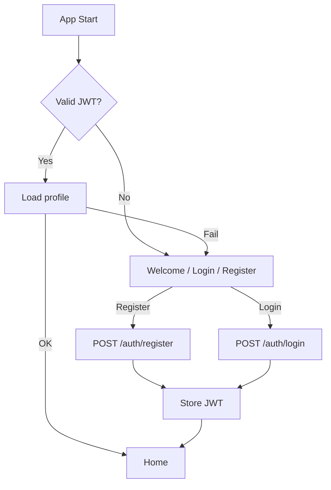

# Module 1 — User Registration, Login & Profile

## Overview

Module 1 implements authentication and user profile management for the STJ (Spiritual/Joshiyam) application. Identity is handled by a **Node.js REST API** with **JWT** access tokens and a **MongoDB** user store. The Flutter client uses **Dio** for HTTP and **SharedPreferences** for persisting the token.

**Typical flow**: **Register or Login → Home**. Protected screens load the profile using `Authorization: Bearer <jwt>`.

---

## Architecture

### Technology Stack

| Layer | Technology | Purpose |
|-------|-----------|---------|
| **Frontend** | Flutter | Cross-platform UI |
| **State Management** | BLoC (flutter_bloc) | Predictable state |
| **Authentication** | JWT (backend-issued) | Login/register; token on protected calls |
| **Backend API** | Node.js + Express | REST API |
| **Database** | MongoDB | User data |
| **HTTP Client** | Dio | Network requests |
| **Local Storage** | SharedPreferences | JWT persistence |

### Architecture Pattern

Clean Architecture: presentation (UI + BLoC) → domain (entities, use cases, repository contracts) → data (remote datasource, repository implementation).

---

## Features Implemented

### 1. User Registration
- Phone, password, name; optional DOB, birth time, birth place
- Backend creates user and may return JWT; client stores token when present

### 2. User Login
- Phone + password → JWT + user payload

### 3. Profile Management
- Fetch and update profile via authenticated API

### 4. Password recovery
- Forgot-password request to backend (phone normalized same as login)

### 5. Session management
- Token in SharedPreferences; splash checks session via profile/verify

### 6. Legacy verify route
- `VerifyEmailPage` remains as a named route for stable navigation; UI explains phone-based sign-in (no separate email verification in-app)

---

## Project Structure (excerpt)

```
lib/
├── core/
│   ├── constants/       # api_constants, app_constants
│   ├── network/         # dio_client, api_service
│   ├── services/        # token_service.dart
│   └── utils/           # validators, date_utils
├── features/auth/
│   ├── data/
│   │   ├── datasources/auth_remote_datasource.dart
│   │   ├── models/user_model.dart
│   │   └── repositories/auth_repository_impl.dart
│   ├── domain/
│   │   ├── entities/, repositories/, usecases/
│   └── presentation/
│       ├── bloc/
│       ├── pages/
│       └── widgets/
├── routes/app_routes.dart
├── app.dart
└── main.dart
```

---

## Authentication Flow (conceptual)



---

## Database schema (illustrative)

Backend-owned. Example shape:

```javascript
{
  "_id": ObjectId("..."),
  "phone": "+919876543210",     // Unique where enforced by API
  "name": "Ramesh Kumar",
  "email": "user@example.com",  // Optional, if backend stores it
  "passwordHash": "...",
  "dob": ISODate("1990-05-15T00:00:00Z"),
  "birthTime": "08:30",
  "birthPlace": "Chennai, Tamil Nadu",
  "createdAt": ISODate("..."),
  "updatedAt": ISODate("...")
}
```

Indexes depend on backend design (e.g. unique `phone`).

---

## API Endpoints (client)

Base URL is defined in `lib/core/constants/api_constants.dart` (e.g. production host on Render).

| Method | Path | Purpose |
|--------|------|---------|
| POST | `/auth/register` | Register; response may include `data.token` and `data.user` |
| POST | `/auth/login` | Login with phone + password → `data.token`, `data.user` |
| GET | `/auth/verify` | Validate JWT, return user |
| POST | `/auth/forgot-password` | Start reset flow (phone) |
| POST | `/auth/reset-password` | Complete reset (if implemented by API) |
| GET | `/profile` | Current user |
| PUT | `/profile` | Update profile |

Protected routes use:

```
Authorization: Bearer <jwt>
```

Envelope used by client parsers: `{ "success": true, "data": { ... } }` (see `AuthRemoteDataSourceImpl`).

---

## BLoC

### Events (current)

- `AuthCheckRequested`
- `AuthRegisterRequested` (phone, password, name, optional dob/birthTime/birthPlace)
- `AuthLoginRequested`
- `AuthLogoutRequested`
- `AuthForgotPasswordRequested` (parameter named `email` in code but value is passed through phone normalization for API)
- `AuthGetProfileRequested`
- `AuthUpdateProfileRequested`

### States (current)

- `AuthInitial`, `AuthLoading`, `AuthAuthenticated`, `AuthUnauthenticated`, `AuthError`, `AuthSuccess`, `AuthPasswordResetEmailSent`

---

## Setup

1. `cd client && flutter pub get`
2. Set `ApiConstants.baseUrl` to your backend URL
3. `flutter run`

No third-party mobile SDK config files are required for auth beyond HTTP.

---

## pubspec.yaml (auth-related)

```yaml
dependencies:
  flutter_bloc: ^8.1.6
  equatable: ^2.0.5
  dio: ^5.7.0
  shared_preferences: ^2.3.2
  intl: ^0.19.0
```

---

## Troubleshooting

- **Dependency errors**: run `flutter pub get`
- **API errors / timeouts**: confirm backend URL, cold starts (e.g. Render), and network; client uses extended timeouts for slow wake-ups
- **401 on profile**: token missing or expired — log in again

---

## Security notes

1. Passwords are handled by the backend (hashed server-side); the app sends credentials over HTTPS only in production.
2. Protected API calls send JWT in the `Authorization` header.
3. Use HTTPS in production; validate and rate-limit on the server.

---

## Module 1 status

**Frontend**: Implemented around phone + JWT + REST.  
**Backend**: Must implement or match the endpoints and response envelope above.

**Last updated**: March 28, 2026
